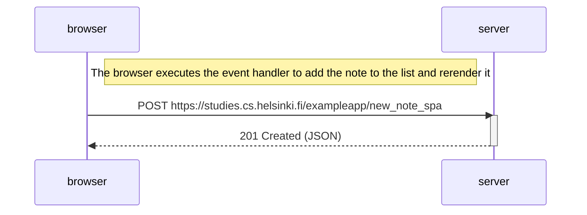

# Full Stack Open - Part 0

## Exercise 0.6: New Note in Single Page App

```mermaid
sequenceDiagram
    participant browser
    participant server

    Note right of browser: The browser executes the event handler to add the note to the list and rerender it

    browser->>server: POST https://studies.cs.helsinki.fi/exampleapp/new_note_spa
    activate server
    server-->>browser: 201 Created (JSON)
    deactivate server
```